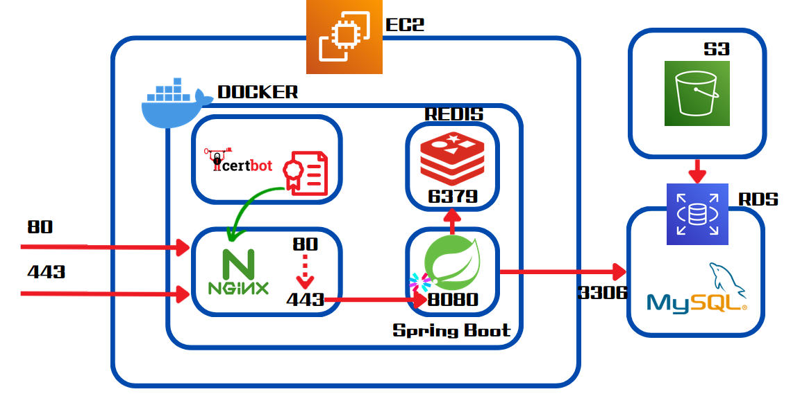

# ModernWorldV2 - Backend, JS -> JAVA Migration Project

### [모던월드 바로가기](https://modern-world.kr)


> **"NestJS 기반의 웹 커뮤니티/게임 서비스를 Spring Boot + (JPA, QueryDSL) 환경으로 마이그레이션하며, DDD 및 헥사고날 아키텍처를 도입해
유지보수성을 높인 백엔드 프로젝트입니다."**
---

## 🏗️ 아키텍처

이 프로젝트는 **DDD(Domain-Driven Design)** 원칙에 따라 컨텍스트(Bounded Context)별로 도메인 패키지를 분리하고, **Hexagonal
Architecture(Ports and Adapters)** 패턴을 적용하여 외부 의존성으로부터 핵심 로직을 보호했습니다.

    📦 src/main/java/kr/modernworld/modernworldv2
        ├── 📂 asset # 자산 Context (캐릭터, 인벤토리, 아이템, 상점)
            ├── 📂 presentation (Controller: Web/Client 요청 처리)
            ├── 📂 infrastructure (Implements(구현체): DB, Redis 등 외부 시스템과의 통신 구현)
            ├── 📂 application (Service: 도메인 객체의 흐름 제어 및 트랜잭션 관리) 
            └── 📂 domain # (Domain Model: 핵심 비즈니스 규칙 및 상태 변경 로직)
        ├── 📂 growth # 성장 Context (업적, 칭호)
        ├── 📂 member # 회원 Context (사용자, 인증, 소셜 토큰)
        ├── 📂 social # 소셜 Context (게시글, 댓글, 쪽지, 가위바위보 게임)
        ├── 📂 notification # 알림 Context (SSE, 알람)
        └── 📂 global # 전역 설정 및 유틸리티

- 상위 모듈(Domain/Application)이 하위 모듈(Infrastructure)에 의존하지 않도록 Port(Interface)와 해당 구현체를 두어 결합도를 낮췄습니다.
- 각 도메인은 독립적으로 동작하며, 다른 도메인의 로직을 침범하지 않도록 설계되었습니다.
- 도메인 간 협력이 필요한 경우, **Event-Listener** 구조를 활용하여 도메인 간의 의존성을 최소화하고 응집도를 높였습니다.
- **CQRS 패턴**을 적용하여 Command - Query 분리로 도메인 모델은 조회 관련 사항을 신경쓰지 않도록 하여 불필요한 로직을 없앴습니다.

---

## 🔑 주요 기능

### 👤 Member & Auth

- **OAuth 2.0 로그인**: Google, Kakao, Naver 소셜 로그인 및 토큰 관리.
- **Stateless 인증**: JWT Access/Refresh Token 및 Cookie 기반 보안 인증 시스템 구축.

### 🎮 Social & Play

- **커뮤니티**: 게시글/댓글 작성, 좋아요(Like) 및 대댓글(Reply) 기능.
- **미니 게임**: 가위바위보(RSP) 게임 로직 및 승패 전적 기록.
- **소셜 네트워크**: 유저 간 이웃(Neighbor) 맺기 및 관계 관리.

### 💰 Asset & Growth

- **경제 시스템**: 포인트 재화를 이용한 캐릭터/아이템 구매 및 선물하기(Present) 기능.
- **성장 시스템**: 활동에 따른 업적(Achievement) 달성 및 칭호(Legend) 획득.

### 🔔 Notification

- **실시간 알림**: SSE(Server-Sent Events)를 활용한 댓글, 선물 수신 등 실시간 이벤트 전송.

---

## ⚡️ 이슈와 해결책

### 1. Jakarta Persistence 호환성을 위한 QueryDSL 버전 교체

- **Issue**: 기존 표준 QueryDSL 라이브러리의 유지보수 중단 이슈와 보안 상 이슈(SQL Injection Attack)가 있었습니다.

- **Solution**: OpenFeign에서 관리하는 `querydsl-jpa:7.1` 버전을 채택하여 최신 보안 패치와 안정성을 챙겼습니다.

### 2. MapStruct를 활용한 생산성 및 안정성 확보

- **Issue**: 헥사고날 아키텍처 도입으로 계층 간 (Domain Object ↔ JPA Entity) 데이터 변환 로직이 급증하여, 수동 매핑 코드로
  인한 실수 발생 가능성과 생산성 저하가 우려되었습니다.

- **Solution**: `MapStruct`를 도입하여 컴파일 시점에 Type-Safe한 매핑 코드를 자동 생성하도록 했습니다. 이를 통해 런타임 오버헤드 없이 성능을
  유지하면서도 비즈니스 로직에 집중할 수 있는 환경을 구축했습니다.

### 3. 기존 NestJS Application에 대한 OAuth2.0 흐름에 대한 문제 발견

- **Issue**: 기존 NestJS 기반 인증 로직 분석 결과, OAuth 2.0 스펙에서 권장하는 CSRF(사이트 간 요청 위조) 방지용 state 파라미터 검증 절차가
  누락되어 보안 취약점이 존재함을 식별했습니다.

- **Solution**: 난수기반의 state값을 생성 및 검증하는 방식을 통해 CSRF Attack에 대비하였습니다.

### 4. OAuth 2.0 인증 과정의 Stateless화 및 리소스 최적화

- **Issue**: 프로젝트 진행중에는 OAuth 로그인 시도 시 생성되는 CSRF 방지용 state 값을 서버 세션(Redis)에 임시 저장했습니다. 이로 인해 로그인
  페이지에 접근만 하고 이탈하는 요청이 급증할 경우, 불필요한 데이터가 메모리에 누적되어 리소스 낭비 및 잠재적인 성능 저하를 유발했습니다.

- **Solution**: state 값을 서버에 저장하는 대신, **클라이언트 쿠키(Cookie)** 에 담아 전송하고 검증하는 방식으로 변경했습니다. 이를 통해 인증 대기
  상태(Handshake)에서의 서버 저장소(Session/Redis) 의존성을 완전히 제거하여, 트래픽 증가에도 안정적인 Stateless 아키텍처를 완성했습니다.

---

## 📑 ERD


---

## ▶️ Server Flow



## 🛠️ Tech Stack

| Category        | Technology                                 |
|:----------------|:-------------------------------------------|
| **Language**    | Java 17                                    |
| **Framework**   | Spring Boot 3.5.3                          |
| **Database**    | MySQL 8.0, Redis 7.2.5                     |
| **ORM / Query** | Spring Data JPA, QueryDSL 7.1 (OpenFeign)  |
| **Build Tool**  | Gradle                                     |
| **DevOps**      | Docker, Docker Compose, Github action, AWS |

---

## 📋 브랜치, 커밋 컨벤션

이 프로젝트는 [브랜치명 컨벤션](.github/BRANCH_CONVENTION.md)을 따릅니다.

형식: `<type>/<이슈번호>-<간단한설명>`

```
- `feat/42-login-api`
- `fix/17-header-overlap`
```

이 프로젝트는 [커밋 메시지 컨벤션](.github/COMMIT_CONVENTION.md)을 따릅니다.

```
✨feat: 로그인 기능 추가 (#12)
```

---

## 📮 이슈 및 기여

PR 전 커밋 컨벤션을 꼭 확인해주세요

새로운 기능 요청이나 버그 관련 정보는 GitHub Issues를 통해 남겨주세요

---

## 🪪 라이선스

이 프로젝트는 [Apache 2.0](LICENSE.txt) 라이선스를 따릅니다.
